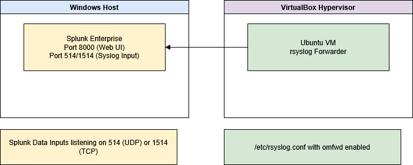

# SOC Analyst Home Lab

A personal Security Operations Center (SOC) lab environment, designed to showcase skills relevant to cybersecurity and SOC analyst roles. This lab integrates a Windows-based Splunk SIEM server with an Ubuntu Linux virtual machine acting as a log source, demonstrating log forwarding, ingestion, and analysis.

## Table of Contents

- [About](#about)
- [Features](#features)
- [Installation](#installation)
- [Usage](#usage)
- [Screenshots](#screenshots)
- [Troubleshooting](#troubleshooting)
- [License](#license)

## About

This project documents the step-by-step deployment of a SOC lab in a home environment, including key lessons learned, troubleshooting techniques, and configuration notes. It is intended as both a portfolio piece and a replicable guide for others entering cybersecurity.

## Features

- Windows Splunk Enterprise SIEM
- Ubuntu Linux log source
- rsyslog configuration and forwarding
- Splunk Data Inputs for TCP/UDP syslog
- Troubleshooting logs with documented lessons learned
- Written as a reproducible, real-world home lab for SOC analyst practice

## Architecture Diagram

The diagram below illustrates the architecture of the SOC Analyst Home Lab environment. It shows the Windows host running Splunk Enterprise, the Ubuntu VM acting as a log source, and the flow of syslog data from the VM to Splunk.



*Diagram source file included as [soc-lab.drawio](./screenshots/soc-lab.drawio) for editing in diagrams.net (draw.io).*


## Installation

The full build and configuration guide is available in [SOC_Analyst_HomeLab_Documentation.md](./docs/SOC_Analyst_Home_Lab_Documentation.md).

## Usage

After following the documented steps, you can:

- Ingest Linux syslog into Splunk
- Search, filter, and create dashboards within Splunk
- Practice detection engineering and alert building
- Expand to additional data sources in the future (Windows logs, Zeek, Suricata, etc.)

## Screenshots

| Screenshot | Description |
|------------|-------------|
| `01_ubuntu_vm_overview.png` | VirtualBox view of the configured Ubuntu log source |
| `02_ubuntu_syslog_conf_location.png` | Example rsyslog.conf showing where to insert the Windows IP |
| `03_ubuntu_omfwd_enabled.png` | Confirmation of `omfwd` module loading in rsyslog |
| `04_splunk_empty_dashboard.png` | Blank Splunk dashboard, ready for future visualizations |
| `05_splunk_syslog_search.png` | Splunk search showing successful syslog ingestion |
| `06_splunk_data_inputs.png` | Splunk Data Inputs page verifying the syslog input settings |

## 🩵 Troubleshooting

The lab documentation includes a full troubleshooting section. Key highlights:

- Confirming Splunk inputs are listening (using `netstat`)
- Validating rsyslog syntax and status (`systemctl status rsyslog`)
- Ensuring Windows Defender firewall rules allow required ports
- Checking VM network reachability (ping, nc)
- Manually testing with `logger`

If syslog messages are still not reaching Splunk, also verify that the `omfwd` module is loaded in your `rsyslog.conf` or included config:

```bash
module(load="omfwd")
